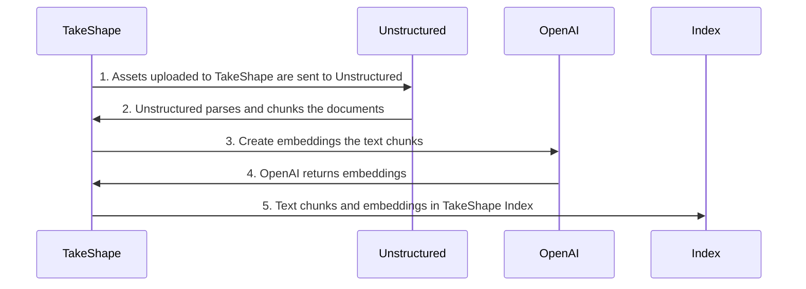
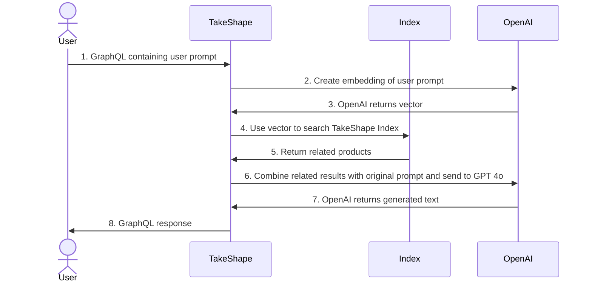

# Unstructured RAG Example
<a href="https://app.takeshape.io/add-pattern?repo=https://github.com/takeshape/unstructured-rag-example"></a>


## Instructions

### Create a new TakeShape Project
1. Click [Deploy to TakeShape](https://app.takeshape.io/add-pattern?repo=https://github.com/takeshape/unstructured-rag-example).
1. Select "Create new project" from the dropdown
1. Enter a name for the new project or leave the default
1. Click "Add to TakeShape"

### Add your API keys

#### Unstructured 


Follow the directions in the [TakeShape Unstructured documentation](https://app.takeshape.io/docs/services/providers/unstructured) to connect Unstructured API


#### OpenAI

1. Create an OpenAI API Key https://platform.openai.com/api-keys with the "Models" and "Model capabilities" permissions (this example uses `/v1/embeddings` and `/v1/chat/completions`)
2. Copy/paste your API key into the service configuration dialog
3. Click "Save"

### Try it out!
Once your services are connected now try out the API in the API Explorer

```graphql
mutation {
  chat(input: "what shoes should I buy?")
}
```

```graphql
query {
  getRelatedDocumentList(text: "what shoes should I buy?") {
    items {
      filename
      chunks {
        text
      }
    }
    total
  }
}
```

## How it works

This example demonstrates how to use TakeShape's vector capabilities combined with indexing to enable the RAG use-case. A prerequisite for RAG is to populate a vector database, for this example we will use TakeShape's built-in index. The first step to preparing our data is to create the `Document` which extends the built-in Asset shape from TakeShape but adds `chunks` an array of text chunks and their corresponding vector embeddings.


Now that our `Document` data is stored in the built-in index we can perform RAG:

